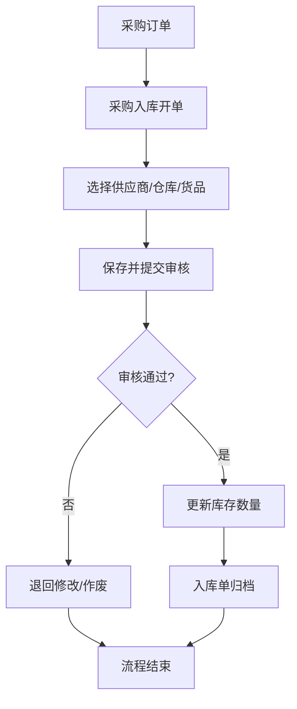
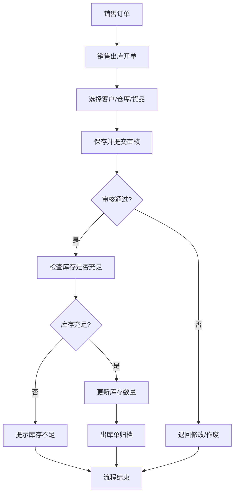
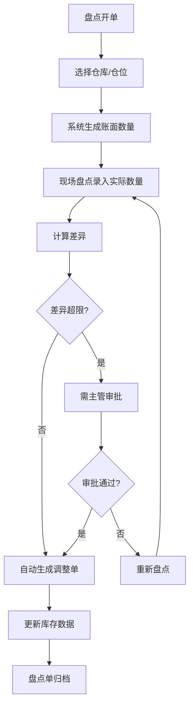

# 仓库管理系统 - 产品需求文档

## 1. 产品概述

基于金蝶软件仓库管理模块功能需求，开发一套网页版仓库管理系统。系统面向企业仓库管理人员、采购人员、财务人员等，支持完整的仓库业务流程管理，包括入库、出库、库存查询、盘点等核心功能，实现仓库管理的信息化、规范化、流程化。

## 2. 核心功能

### 2.1 用户角色

| 角色 | 说明 | 核心权限 |
|------|------|----------|
| 仓库管理员 | 负责仓库日常运营管理 | 基础资料管理、入库管理、出库管理、库存查询、盘点管理 |
| 采购人员 | 负责采购入库操作 | 采购入库、入库单查询 |
| 财务人员 | 负责库存账务核对 | 库存报表查看、入库汇总、出库汇总 |

### 2.2 功能模块

1. **首页/仪表盘** - 系统概览、库存预警、待处理业务
2. **基础资料管理** - 仓库信息、仓位信息、货品分类、货品档案、供应商管理
3. **入库管理** - 采购入库、生产入库、退货入库、入库单查询
4. **出库管理** - 销售出库、生产领料、报废出库、出库单查询
5. **库存管理** - 库存查询、库存预警、盘点管理、库存调整
6. **报表管理** - 库存报表、入库汇总报表、出库汇总报表

### 2.3 页面详情

| 页面名称 | 模块名称 | 功能描述 |
|----------|----------|----------|
| 首页仪表盘 | 概览卡片 | 显示今日入库/出库数量、库存预警数量、待处理单据 |
| 首页仪表盘 | 快捷入口 | 入库登记、出库登记、库存查询、盘点开单 |
| 首页仪表盘 | 库存预警列表 | 显示低于安全库存的货品 |
| 基础资料-仓库管理 | 仓库列表 | 仓库的增删改查，支持启用/禁用状态 |
| 基础资料-仓位管理 | 仓位列表 | 按仓库分组显示仓位，支持层级结构 |
| 基础资料-货品分类 | 分类树 | 树形结构展示货品分类，支持拖拽排序 |
| 基础资料-货品档案 | 货品列表 | 货品信息管理，支持多条件筛选、导入导出 |
| 基础资料-供应商管理 | 供应商列表 | 供应商增删改查 |
| 入库管理-采购入库 | 入库单新增 | 选择供应商、仓库、货品明细、自动计算金额 |
| 入库管理-采购入库 | 入库单列表 | 支持按日期、供应商、仓库、单据状态筛选 |
| 入库管理-入库单详情 | 明细查看 | 查看入库单完整信息，支持审核/作废 |
| 出库管理-销售出库 | 出库单新增 | 选择客户、仓库、货品明细、关联销售订单 |
| 出库管理-销售出库 | 出库单列表 | 支持按日期、客户、仓库、单据状态筛选 |
| 库存管理-库存查询 | 库存台账 | 按仓库/货品维度查看实时库存 |
| 库存管理-库存预警 | 预警设置 | 设置货品的安全库存量 |
| 库存管理-库存预警 | 预警列表 | 显示低于安全库存的货品清单 |
| 库存管理-盘点管理 | 盘点开单 | 生成盘点单，记录账面数量 |
| 库存管理-盘点管理 | 盘点录入 | 录入实际盘点数量，计算差异 |
| 库存管理-盘点管理 | 盘点差异 | 显示盘点差异，支持生成调整单 |
| 报表管理-库存报表 | 库存台账表 | 按时间范围、仓库、货品维度汇总 |
| 报表管理-入库汇总 | 入库汇总表 | 按供应商、时间维度汇总入库情况 |
| 报表管理-出库汇总 | 出库汇总表 | 按客户、时间维度汇总出库情况 |

## 3. 核心流程

### 3.1 采购入库流程

### 3.2 销售出库流程

### 3.3 盘点流程

## 4. 用户界面设计

### 4.1 设计风格

- **整体风格**: 简洁专业的企业级后台管理系统，参考金蝶、用友等主流ERP系统
- **色彩体系**:
  - 主色: #1E40AF (深蓝色 - 专业、可信)
  - 辅助色: #3B82F6 (亮蓝色 - 主要按钮/链接)
  - 成功色: #10B981 (绿色 - 入库/成功状态)
  - 警告色: #F59E0B (橙色 - 预警/待处理)
  - 危险色: #EF4444 (红色 - 出库/错误/作废)
  - 背景色: #F8FAFC (浅灰蓝 - 页面背景)
  - 卡片背景: #FFFFFF (白色)
- **字体**: 思源黑体 (Source Han Sans) / Noto Sans SC，配合等宽字体用于数据展示
- **布局**: 左侧导航 + 右侧内容区的经典后台布局
- **图标**: 使用 Lucide Icons，线性风格

### 4.2 页面设计概览

| 页面名称 | 模块名称 | UI元素 |
|----------|----------|--------|
| 首页仪表盘 | 概览卡片 | 白色卡片 + 阴影，图标+数字+标签布局 |
| 首页仪表盘 | 快捷入口 | 4列图标按钮网格 |
| 基础资料 | 列表页 | 搜索栏 + 筛选条件 + 数据表格 + 分页 |
| 入库/出库 | 开单页 | 表单布局 + 明细表格 + 底部汇总栏 |
| 库存查询 | 台账页 | 左侧树形筛选 + 右侧数据表格 |
| 报表管理 | 报表页 | 日期范围选择 + 表头统计卡片 + 数据表格/图表 |

### 4.3 响应式设计

- 桌面端优先设计，最小宽度 1280px
- 平板端 (1024px) 侧边栏可折叠
- 不强制支持移动端，但保证基本可用性

## 5. 技术架构

详细技术方案见技术架构文档。
