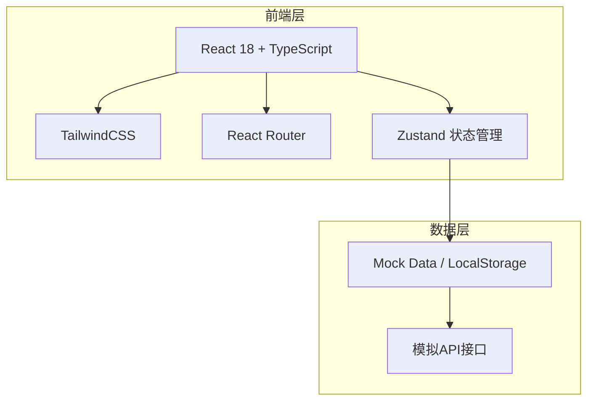
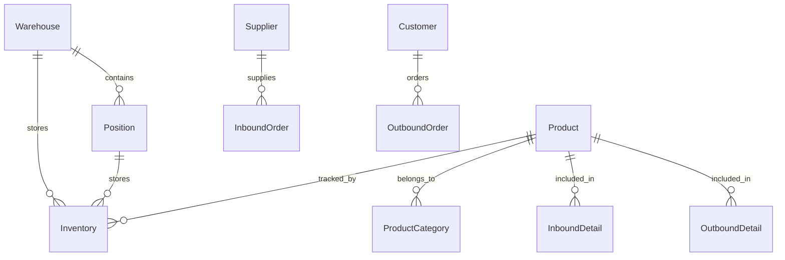

# 仓库管理系统 - 技术架构文档

## 1. 架构设计



## 2. 技术选型

- **前端框架**: React 18 + TypeScript
- **构建工具**: Vite
- **样式方案**: TailwindCSS
- **路由管理**: React Router v6
- **状态管理**: Zustand
- **图标库**: Lucide React
- **日期处理**: Day.js
- **表格组件**: TanStack Table (React Table)
- **表单验证**: Zod + React Hook Form
- **数据模拟**: 内置Mock数据

## 3. 路由定义

| 路由路径 | 页面名称 | 说明 |
|----------|----------|------|
| / | 首页仪表盘 | 概览、快捷入口、库存预警 |
| /basic/warehouse | 仓库管理 | 仓库列表 |
| /basic/position | 仓位管理 | 仓位列表 |
| /basic/category | 货品分类 | 分类树 |
| /basic/product | 货品档案 | 货品列表 |
| /basic/supplier | 供应商管理 | 供应商列表 |
| /inbound/purchase | 采购入库 | 入库单列表/新增 |
| /inbound/production | 生产入库 | 生产入库单 |
| /inbound/return | 退货入库 | 退货入库单 |
| /outbound/sales | 销售出库 | 出库单列表/新增 |
| /outbound/production | 生产领料 | 领料单 |
| /outbound/scrap | 报废出库 | 报废出库单 |
| /stock/query | 库存查询 | 库存台账 |
| /stock/warning | 库存预警 | 预警设置/列表 |
| /stock/check | 盘点管理 | 盘点开单/录入 |
| /stock/adjust | 库存调整 | 调整单 |
| /report/stock | 库存报表 | 库存台账表 |
| /report/inbound | 入库汇总 | 入库汇总表 |
| /report/outbound | 出库汇总 | 出库汇总表 |

## 4. 数据模型

### 4.1 实体关系



### 4.2 核心数据结构

```typescript
// 仓库
interface Warehouse {
  id: string;
  code: string;
  name: string;
  address: string;
  manager: string;
  status: 'enabled' | 'disabled';
  remark?: string;
}

// 仓位
interface Position {
  id: string;
  code: string;
  name: string;
  warehouseId: string;
  parentId?: string;
  status: 'enabled' | 'disabled';
}

// 货品分类
interface ProductCategory {
  id: string;
  code: string;
  name: string;
  parentId?: string;
  sort: number;
}

// 货品
interface Product {
  id: string;
  code: string;
  name: string;
  categoryId: string;
  unit: string;
  specification?: string;
  safeStock: number;
  purchasePrice: number;
  sellingPrice: number;
  status: 'enabled' | 'disabled';
}

// 供应商
interface Supplier {
  id: string;
  code: string;
  name: string;
  contact: string;
  phone: string;
  address: string;
  status: 'enabled' | 'disabled';
}

// 客户
interface Customer {
  id: string;
  code: string;
  name: string;
  contact: string;
  phone: string;
  address: string;
  status: 'enabled' | 'disabled';
}

// 库存
interface Inventory {
  id: string;
  productId: string;
  warehouseId: string;
  positionId: string;
  quantity: number;
  frozenQuantity: number;
}

// 入库单
interface InboundOrder {
  id: string;
  orderNo: string;
  type: 'purchase' | 'production' | 'return';
  supplierId?: string;
  warehouseId: string;
  status: 'draft' | 'pending' | 'approved' | 'rejected' | 'cancelled';
  totalAmount: number;
  operator: string;
  createTime: string;
  approveTime?: string;
  approver?: string;
  remark?: string;
  details: InboundDetail[];
}

// 入库明细
interface InboundDetail {
  id: string;
  inboundOrderId: string;
  productId: string;
  positionId: string;
  quantity: number;
  price: number;
  amount: number;
}

// 出库单
interface OutboundOrder {
  id: string;
  orderNo: string;
  type: 'sales' | 'production' | 'scrap';
  customerId?: string;
  warehouseId: string;
  status: 'draft' | 'pending' | 'approved' | 'rejected' | 'cancelled';
  totalAmount: number;
  operator: string;
  createTime: string;
  approveTime?: string;
  approver?: string;
  remark?: string;
  details: OutboundDetail[];
}

// 出库明细
interface OutboundDetail {
  id: string;
  outboundOrderId: string;
  productId: string;
  positionId: string;
  quantity: number;
  price: number;
  amount: number;
}

// 盘点单
interface CheckOrder {
  id: string;
  orderNo: string;
  warehouseId: string;
  status: 'draft' | 'checking' | 'completed' | 'cancelled';
  operator: string;
  createTime: string;
  completeTime?: string;
  remark?: string;
  details: CheckDetail[];
}

// 盘点明细
interface CheckDetail {
  id: string;
  checkOrderId: string;
  productId: string;
  positionId: string;
  bookQuantity: number;
  checkQuantity: number;
  diffQuantity: number;
  diffAmount: number;
  status: 'pending' | 'confirmed';
}
```

## 5. 组件架构

```
src/
├── components/
│   ├── layout/           # 布局组件
│   │   ├── AppLayout.tsx       # 主布局（侧边栏+内容区）
│   │   ├── Sidebar.tsx        # 侧边导航
│   │   └── Header.tsx         # 顶部栏
│   ├── common/           # 通用组件
│   │   ├── DataTable.tsx      # 数据表格
│   │   ├── SearchForm.tsx     # 搜索表单
│   │   ├── Modal.tsx          # 模态框
│   │   ├── Drawer.tsx         # 抽屉
│   │   ├── Button.tsx         # 按钮
│   │   ├── Input.tsx          # 输入框
│   │   ├── Select.tsx         # 下拉选择
│   │   ├── DatePicker.tsx     # 日期选择
│   │   └── Card.tsx           # 卡片
│   └── business/        # 业务组件
│       ├── OrderForm.tsx      # 单据表单
│       └── DetailTable.tsx    # 明细表格
├── pages/               # 页面
│   ├── Dashboard/       # 首页仪表盘
│   ├── Basic/           # 基础资料
│   ├── Inbound/         # 入库管理
│   ├── Outbound/        # 出库管理
│   ├── Stock/           # 库存管理
│   └── Report/          # 报表管理
├── store/               # 状态管理
│   └── useStore.ts      # Zustand store
├── hooks/               # 自定义hooks
├── utils/               # 工具函数
├── mock/                # Mock数据
└── types/               # 类型定义
```

## 6. 页面实现说明

由于页面较多，本项目采用以下策略：

1. **通用组件复用**: 所有列表页使用相同的 DataTable、SearchForm 组件
2. **CRUD 模板化**: 通过配置方式实现基础的增删改查功能
3. **订单流程统一**: 入库/出库单据使用统一的表单和流程组件
4. **报表页**: 使用表格+图表展示数据，支持导出
